# SubHub

A self-hosted proxy subscription management platform. Aggregate multiple proxy sources, organize nodes into collections, build advanced routing profiles, and serve ready-to-use Clash/Mihomo configurations from a single URL.

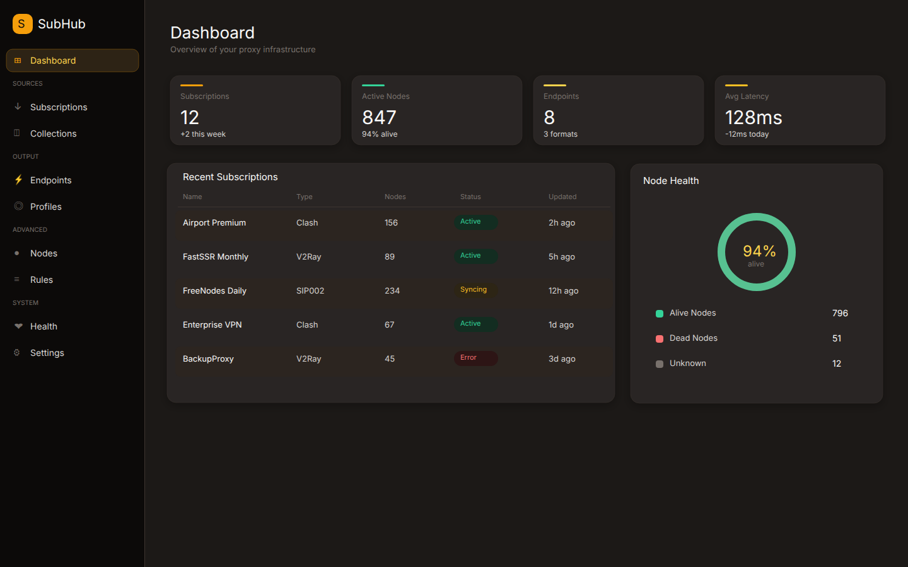

<details>
<summary>Mobile</summary>

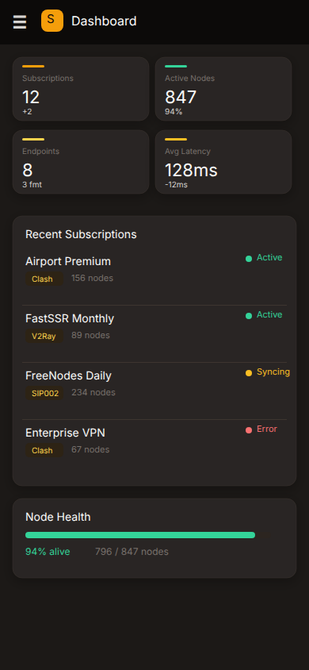

</details>

## Features

- **Subscription Management** -- Import proxies from Clash, V2Ray, and SIP002 URLs with auto-refresh on cron schedules
- **Node Collections** -- Organize self-managed proxy nodes and relay nodes into reusable groups
- **Rule Collections** -- Group domain/IP routing rules into manageable sets
- **Endpoint System** -- Create filtered views of proxies and rules, served as provider URLs (`/p/{slug}`)
- **Profile Builder** -- Compose complete Clash/Mihomo configs with proxy-groups, rule-providers, and routing rules
- **Health Monitoring** -- Check node liveness and latency across all subscriptions
- **Responsive UI** -- Warm Dark theme with desktop sidebar, tablet icon bar, and mobile nav drawer
- **CLI Tool** -- Manage subscriptions, nodes, endpoints, and profiles from the terminal
- **Single Binary** -- Go backend with embedded React frontend, SQLite database, no external dependencies

## Quick Start

### Docker (Recommended)

```bash
mkdir -p data
docker compose up -d
```

Open http://localhost:9000

### Docker Compose

```yaml
services:
  subhub:
    image: ghcr.io/cluas/subhub:latest
    ports:
      - "9000:9000"
    environment:
      - DB_PATH=/data/subhub.db
      - TZ=Asia/Shanghai
    volumes:
      - ./data:/data
    restart: unless-stopped
```

### Build from Source

```bash
# Prerequisites: Go 1.25+, Node.js with pnpm
make build
./subhub serve
```

## Configuration

All configuration via environment variables:

| Variable | Default | Description |
|----------|---------|-------------|
| `PORT` | `9000` | HTTP server port |
| `DB_PATH` | `subhub.db` | SQLite database path |
| `API_TOKEN` | *(empty)* | Bearer token for API auth (empty = no auth) |
| `BASE_URL` | `http://localhost:PORT` | Public URL for generated config URLs |
| `CACHE_TTL_SECONDS` | `300` | Response cache TTL |
| `CORS_ORIGINS` | `*` | Allowed CORS origins |
| `LOG_LEVEL` | `info` | Log level: debug / info / warn / error |

`BASE_URL` can also be set in the web UI Settings page (stored in database, takes priority over env var).

## How It Works

```
Subscriptions (external URLs)       Collections (manual groups)
  └── Proxies (auto-fetched)          ├── Proxy Collections
  └── Rules  (auto-fetched)           └── Rule Collections
          │                                     │
          └──────────┬──────────────────────────┘
                     ▼
              Endpoints (/p/{slug})
              Filtered proxy or rule lists
                     │
                     ▼
              Profiles (/profile/{slug})
              Complete Clash/Mihomo config
              ├── Node Pools (proxy-providers)
              ├── Strategies (proxy-groups)
              ├── Rule Sets (rule-providers)
              └── Routing Rules (ordered rules)
```

## Usage

### 1. Add a Subscription

Go to **Subscriptions** and add your provider URL. Click **Fetch** to pull nodes.

### 2. Create Collections

Create **Proxy Collections** for self-managed nodes (direct + relay). Create **Rule Collections** to group domain/IP rules by purpose (e.g. "AI domains", "company whitelist").

For relay nodes, add `"dialer-proxy": "Transit Group"` in the node config.

### 3. Create Endpoints

Endpoints serve filtered proxy/rule lists at `/p/{slug}`. Set a custom slug, choose a source (subscription or collection), and optionally filter by group name, type, or region.

### 4. Build a Profile

Profiles compose everything into a complete Clash config served at `/profile/{slug}`:

- **Settings** -- port, socks-port, mode, log-level, external-controller
- **Node Pools** -- reference endpoints as proxy-providers with health checks
- **Strategies** -- proxy-groups: select, url-test, fallback, load-balance (with filter, include-all, tolerance)
- **Rule Sets** -- reference rule endpoints or external URLs as rule-providers
- **Routing Rules** -- ordered rules: DOMAIN-SUFFIX, GEOSITE, GEOIP, RULE-SET, MATCH

### 5. Subscribe in Clash

Point your Clash/Mihomo client to:

```
http://your-server:9000/profile/daily
```

## CLI

```bash
# Subscriptions
subhub sub add <url> --name "My Provider"
subhub sub list
subhub sub refresh <id>

# Nodes
subhub node list --sub <id>
subhub node add --collection <id> --name "my-node" --type vless --server 1.2.3.4 --port 443

# Endpoints
subhub endpoint create --sub <id> --format clash --name "Foreign Nodes"
subhub endpoint list

# Profiles
subhub profile list
subhub profile show <id>

# Offline conversion (no server needed)
subhub convert <url> --format clash
subhub convert <url> --format surge --filter "HK"
```

## API

Full REST API reference with examples: [skills/subhub.md](skills/subhub.md)

| Method | Path | Description |
|--------|------|-------------|
| GET | `/profile/{slug}` | Serve profile as Clash YAML |
| GET | `/p/{slug}` | Serve endpoint proxy/rule list |
| * | `/api/subscriptions` | Subscription CRUD + fetch + health-check |
| * | `/api/proxies` | Proxy node CRUD with filters |
| * | `/api/collections` | Collection CRUD |
| * | `/api/endpoints` | Endpoint CRUD + preview |
| * | `/api/profiles` | Profile CRUD + sub-resources |
| * | `/api/profiles/{id}/node-pools` | Node pool CRUD |
| * | `/api/profiles/{id}/strategies` | Strategy (proxy-group) CRUD |
| * | `/api/profiles/{id}/rule-sets` | Rule set CRUD |
| * | `/api/profiles/{id}/routing-rules` | Routing rule CRUD |
| GET/PUT | `/api/settings` | System settings (base_url, etc.) |
| GET | `/api/dashboard/stats` | Dashboard statistics |

## Screenshots

<details>
<summary>Desktop Pages</summary>

| Page | Screenshot |
|------|-----------|
| Subscriptions | 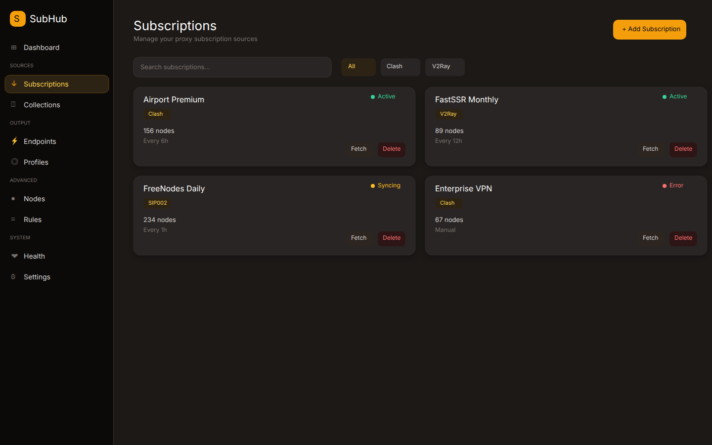 |
| Subscription Detail | 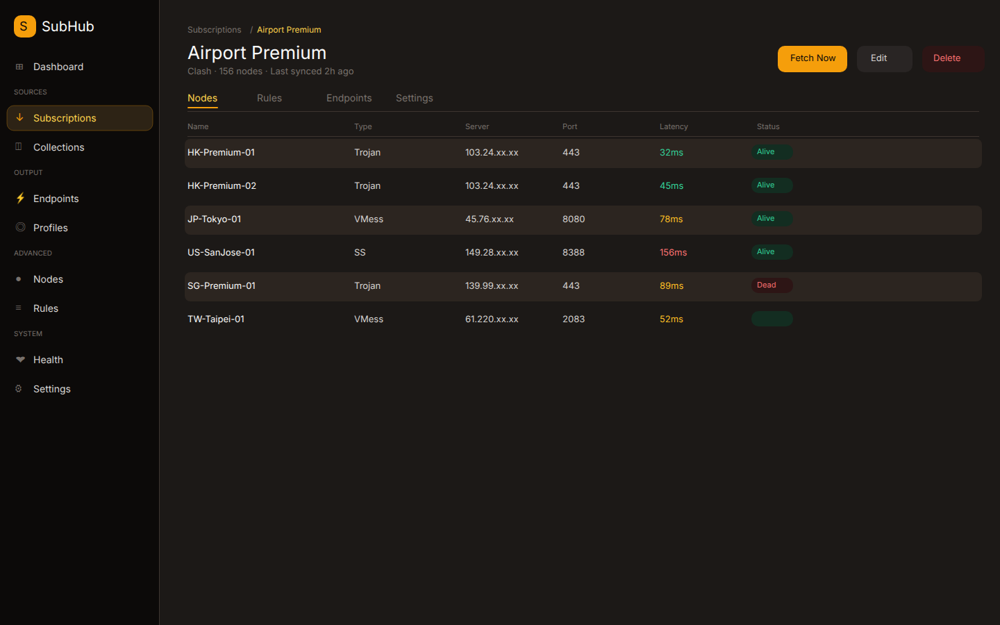 |
| Collections | 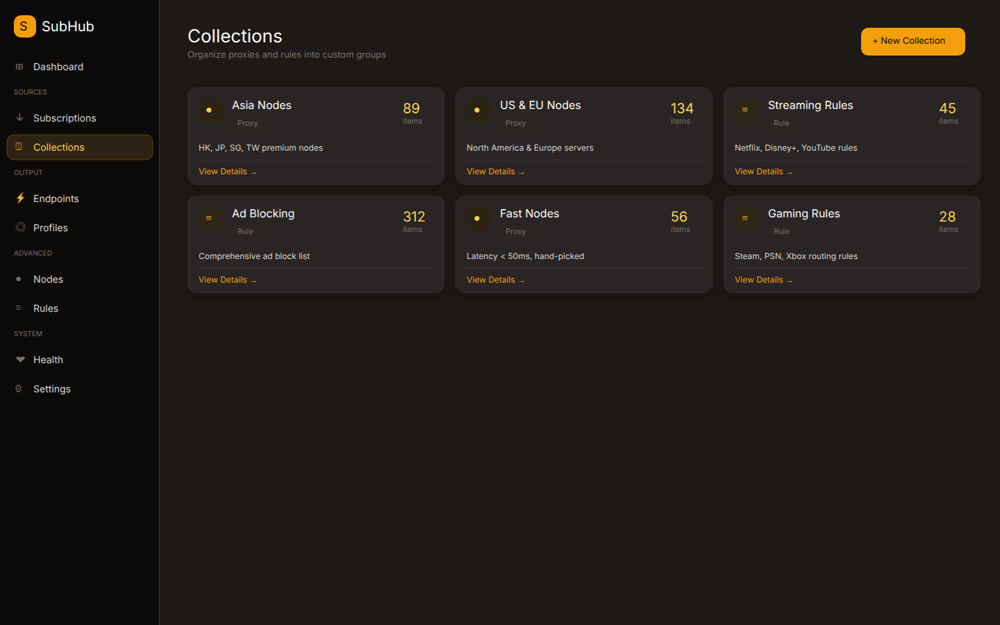 |
| Endpoints | 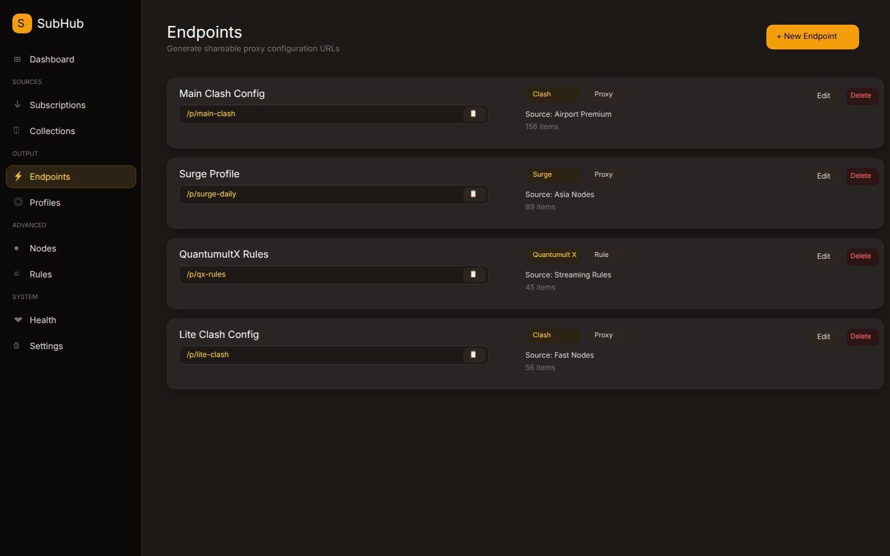 |
| Profiles | 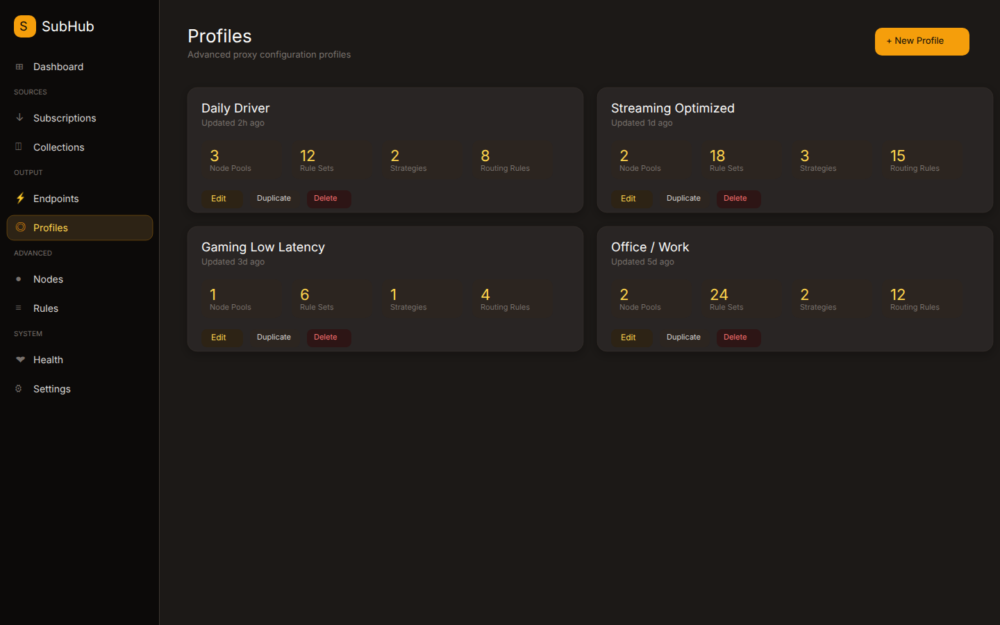 |
| Profile Editor | 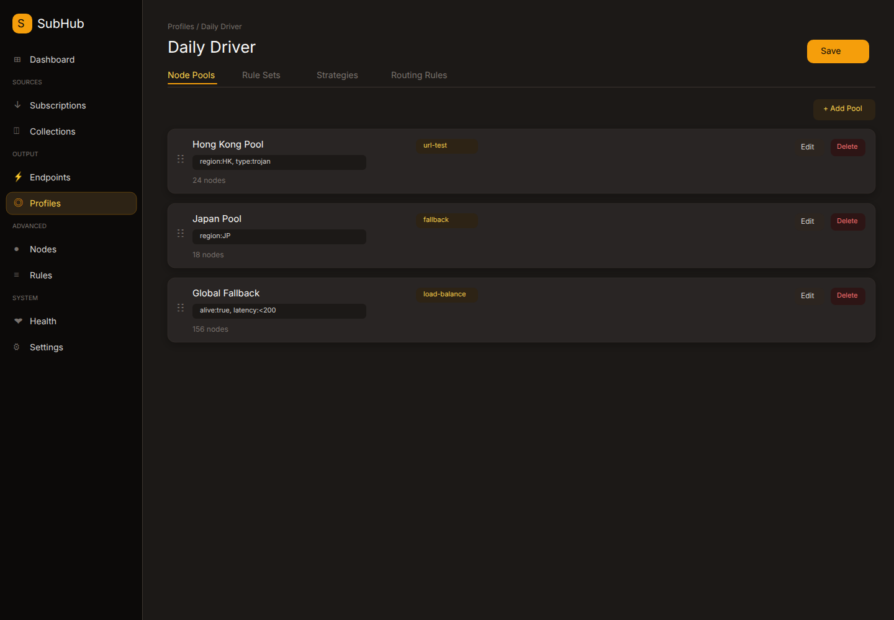 |
| Nodes | 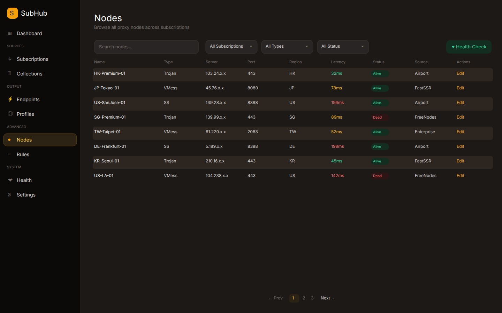 |
| Rules | 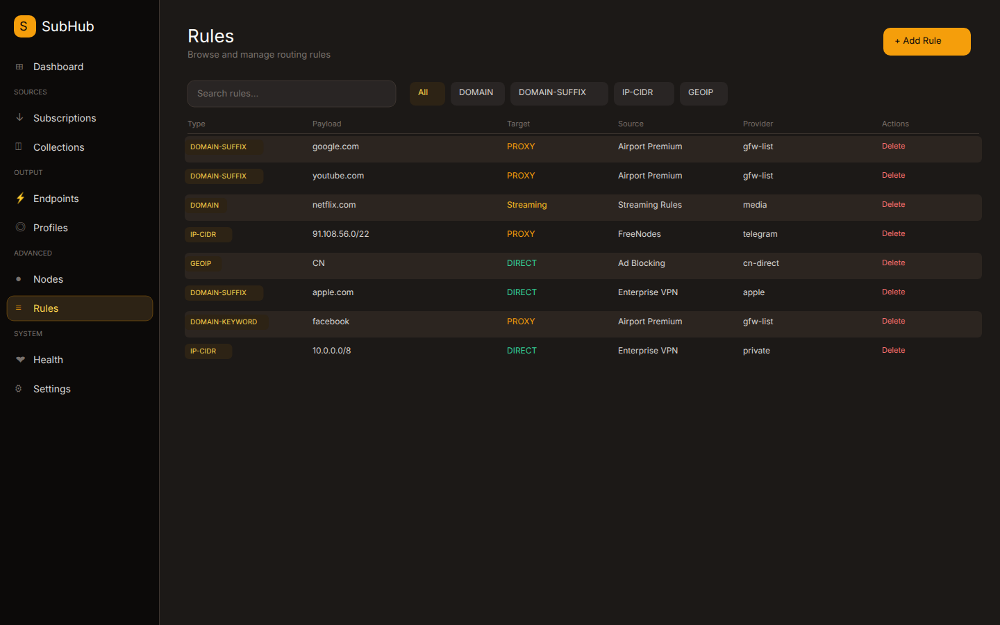 |
| Health | 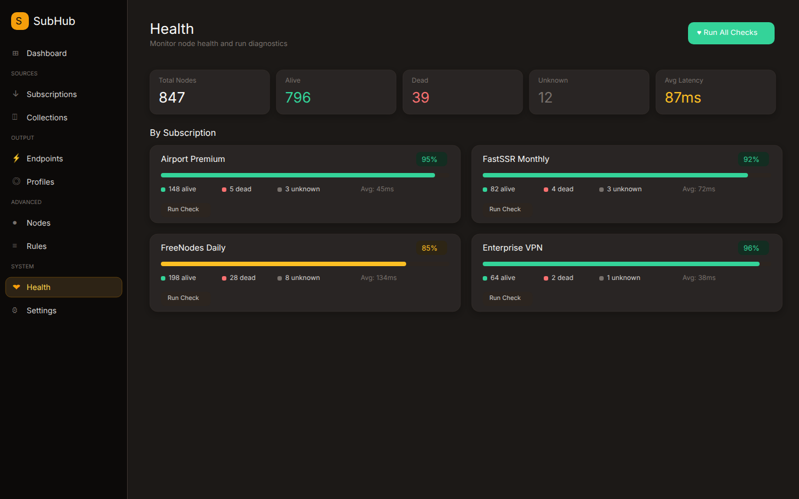 |
| Settings | 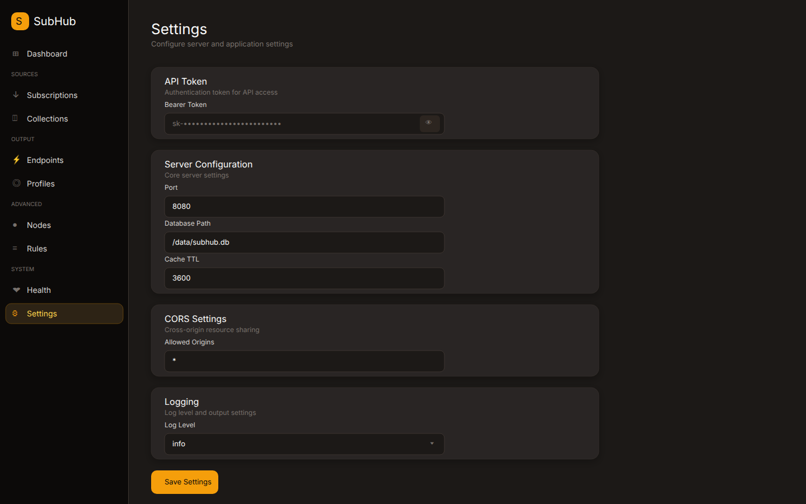 |
| Node Detail | 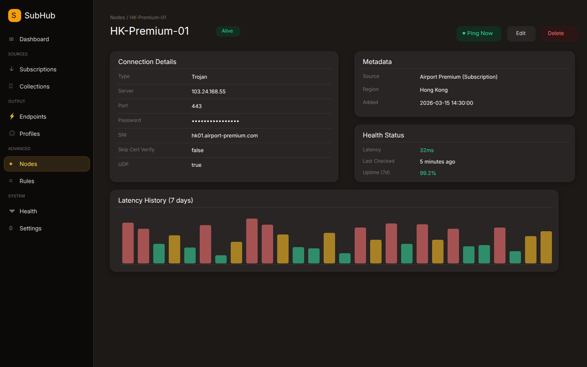 |

</details>

<details>
<summary>Mobile Pages</summary>

| Page | Screenshot |
|------|-----------|
| Nav Drawer | 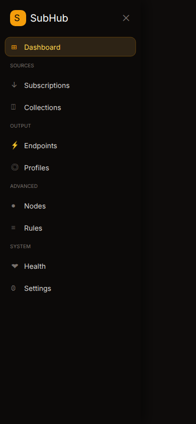 |
| Subscriptions | 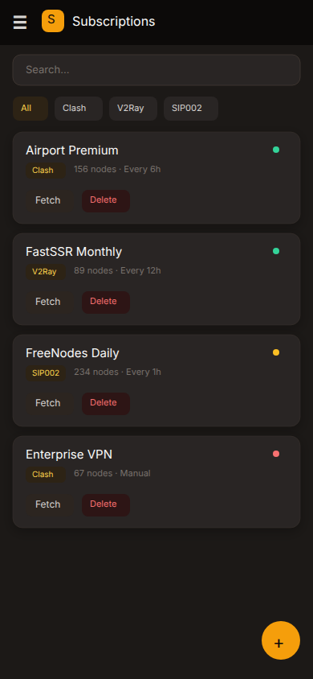 |
| Collections | 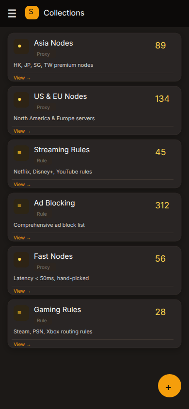 |
| Endpoints | 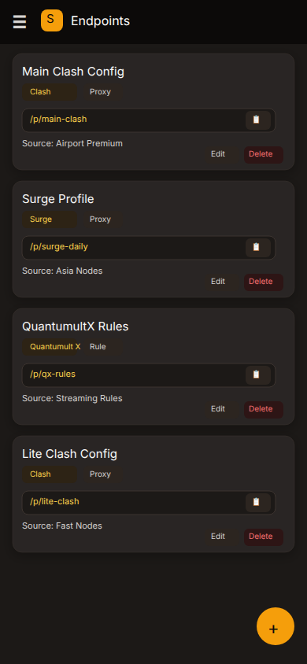 |
| Nodes | 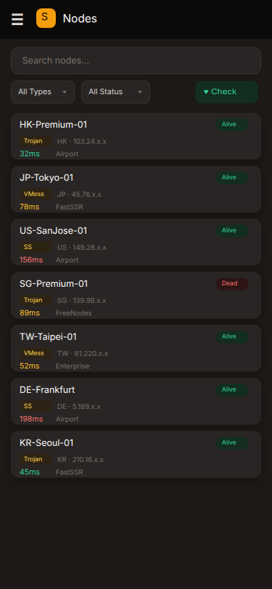 |

</details>

## Tech Stack

| Layer | Technology |
|-------|-----------|
| Backend | Go 1.25, chi router, SQLite (modernc.org/sqlite) |
| Frontend | React 19, TypeScript, Vite 8, Tailwind CSS 4 |
| UI | Radix UI primitives, Lucide icons, Warm Dark theme |
| Database | SQLite with WAL mode, auto-migrations |
| Deploy | Single static binary, Docker, Alpine Linux |

## Development

```bash
make dev-backend    # Backend only (placeholder frontend)
make dev-frontend   # Vite dev server with hot reload
make test           # Run Go tests
make build          # Full production build
```

## License

[MIT](LICENSE)
